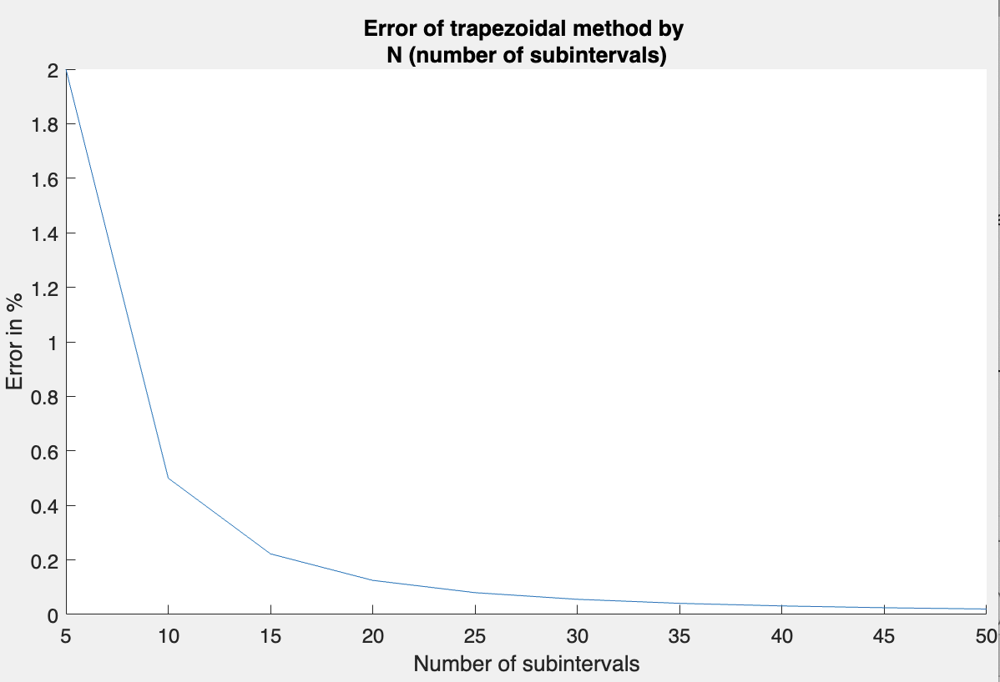

# Integral Approximation Project

## Overview
This project focuses on the numerical approximation of integrals using Chebyshev polynomials. It implements and compares the Trapezoidal and Simpson's methods for integral approximation.

## Features
- Implements numerical integration using Trapezoidal and Simpson's methods.
- Utilizes Chebyshev polynomials of the first and second kind.
- Includes error measurement and optimization techniques.

## Usage
1. Add the project folders to the MATLAB search path.
2. Use functions (`trapezoidal`, `simpson`) for approximate integral calculations of chebyshev polynomials. In the project we provide `chebyshev_combination` function that represents polynomials in the form of: $$w_n(x) = \sum_{k=0}^n a_kT_k(x)U_k(x)$$ where $T_k$ is a chebyshev polynomial of the first kind and $U_k$ - of the second kind. To use `chebyshev_combination` with `trapezoidal` (similarly `simpson`) use the following code (**a** - beggining of the integration interval, **b** - end of the integration interval, **N** - number of subintervals in the composite trapezoidal method, **coefficients** - $a_k$ coefficients for the chebyshev polynomial):
```matlab
    result = trapezoidal(a, b, N, @chebyshev_combination, coefficients)
```
3. Use functions (`trapezoidal_general`, `simpson_general`) for approximate integral calculations of any function $y = f(x)$. For example
```matlab
    result = trapezoidal_general(a, b, N, @my_function)
```
4. Explore the GUI application `examplesGUI.mlapp` for visual demonstration and comparison of aprroximate results with true integrals.
5. Explore the GUI application `errorsGUI.mlapp` for error visualisations.

## Examples
- Several examples (`chebyshev_example_1`, `chebyshev_example_2`, etc.) are provided to demonstrate the effectiveness of the methods in different scenarios. See the [report](Integral_Approximation_Report_ENG.pdf) for full description of the examples.

## Error Analysis
- The project includes a detailed analysis of the errors associated with each method, including heat maps and relative error comparisons.
- One of the takeaways is that increasing the number of subintervals (**hyperparameter N**) for both methods decreases the relative error of the approximation.

<div align="center">
  
  <p>Figure 1: Graph of the dependence of the relative error expressed in (%) on the number of subintervals in integration by the trapezoidal method</p>
</div>

## Authors
- Hubert Kowalski
- Adam Kaniasty

## Date
- 25.11.2023
